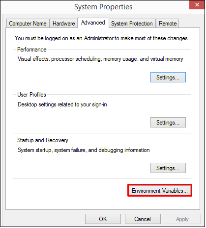

# การตั้งค่า Environment PATH 
ระบบ macOS หรือ OS X ใหม่ๆ อาจจะสงสัยว่า เวลาติดตั้งพวก SDK ต่างๆ แล้วเราจะไปตั้งค่า PATH ตรงไหน บน Windows มันอยู่ใน System Environment แต่บน Mac ไม่เห็นจะมี ?
### สำหรับระบบปฎิบัติการ Windows
  - System Properties คลิกที่ปุ่ม “Environment Variables…”<br>
  
----
### สำหรับระบบปฎิบัติการ MacOS
  - สร้างไฟล์ที่ชื่อว่า .bash_profile

```sh
 cd ~/  
 touch .bash_profile
 ```
  - วิธีเปิด .bash_profile มาแก้ไขใน TextEdit
หลังจากสร้างไฟล์ .bash_profile ขึ้นมาแล้ว เราสามารถสั่งเปิดไฟล์นี้ขึ้นมาแก้ไขบนโปรแกรม TextEdit ประจำเครื่อง Mac ทุกเครื่องได้ ด้วยคำสั่ง

```sh
 open -e ~/.bash_profile
 ```

 - ระบบก็จะเปิดโปรแกรม TextEdit พร้อมข้อความใน .bash_profile มาประมาณนี้ (แต่ละคนไม่จำเป็นต้องเหมือนกันนะ ขึ้นอยู่กับการตั้งค่า)<br>


 - วิธีเพิ่ม PATH Android SDK ลงใน .bash_profile 
  ```sh
  echo export "ANDROID_HOME=/Users/taveevut/Library/Android/sdk" >> ~/.bash_profileexport 
  ```

  - รันคำสั่ง source ~/.bash_profile

<br>
<br>

---
<p align="center"> จัดทำโปรแกรมคอมพิวเตอร์พัฒนาระบบงานธุรกิจส่วนตัวและหน่วยงาน ใส่ใจคุณภาพ คุ้มราคา ส่งงานตรงเวลา<br>ติดต่อ 086-288-7987 (ท็อป) หรืออีเมล์    nakomah.web@gmail.com<br>ติดตามผลงานได้ที่ <a href="https://nakomah.com" target="_blank">www.nakomah.com</a></p>
