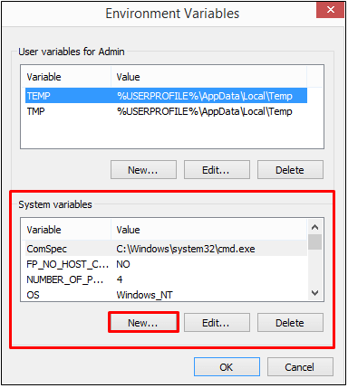
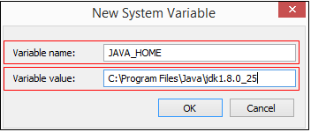
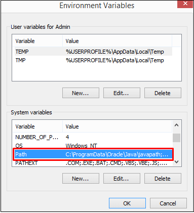
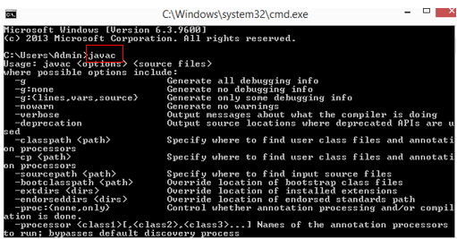
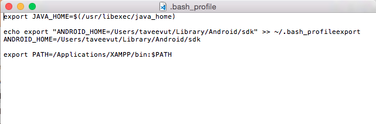

# ติดตั้ง JDK (Java Development Kit )
> ก่อนจะเริ่มต้นเขียนโปรแกรมภาษา Java จะต้องทำการเตรียมเครื่องคอมพิวเตอร์ของเราให้พร้อมในการเขียนโปรแกรม นั่นคือการติดตั้ง JDK หรือ Java Development Kit ซึ่งก็คือชุดเครื่องมือที่ใช้ในการพัฒนาโปรแกรมด้วยภาษา Java หลังจากติดตั้งโปรแกรมแล้วจะทำให้เราสามารถพัฒนาโปรแกรมด้วยภาษา Java ได้ สามารถดาวน์โหลดได้ที่ http://www.oracle.com/technetwork/java/javase/downloads/index-jsp-138363.html และดำเนินการติดตั้งโปรแกรมให้เรียบร้อย

### สำหรับระบบปฎิบัติการ Windows
  - System Properties คลิกที่ปุ่ม “Environment Variables…”<br>
  

  - ในส่วนของ System variable คลิกที่ปุ่ม “New…” <br> 
  

  - จะปรากฏหน้าจอ New System Variable<br>  
        
    Variable name : เราตั้งชื่อว่า “JAVA_HOME” <br>
    Variable value : C:\Program Files\Java\jdk1.8.0_25 <br> 

  - Path ใน System variables<br> 
  
  
  - ดับเบิลคลิกเข้าไปที่ Path C:\ProgramData…….. <br> จะปรากฏหน้าจอ Edit System Variable ขึ้นมา<br>
       
    ในส่วนของ Variable value : ให้เลื่อนเคอร์เซอร์ไปไว้หลังสุด แล้วเพิ่ม “;%JAVA_HOME%\bin” ลงไป จะทำให้เราเรียกใช้โปรแกรมต่าง ๆ ที่อยู่ในโฟลเดอร์ bin ได้ โดยที่ไม่ต้องระบุ Part ยาว ๆ

  - เปิด Command Prompt จากนั้น พิมพ์คำสั่ง javac จะปรากฏดังภาพ<br>
       

---
### สำหรับระบบปฎิบัติการ MacOS
  - สร้างไฟล์ที่ชื่อว่า .bash_profile

```sh
 cd ~/  
 touch .bash_profile
 ```
  - วิธีเปิด .bash_profile มาแก้ไขใน TextEdit
หลังจากสร้างไฟล์ .bash_profile ขึ้นมาแล้ว เราสามารถสั่งเปิดไฟล์นี้ขึ้นมาแก้ไขบนโปรแกรม TextEdit ประจำเครื่อง Mac ทุกเครื่องได้ ด้วยคำสั่ง

```sh
 open -e ~/.bash_profile
 ```

 - ระบบก็จะเปิดโปรแกรม TextEdit พร้อมข้อความใน .bash_profile มาประมาณนี้ (แต่ละคนไม่จำเป็นต้องเหมือนกันนะ ขึ้นอยู่กับการตั้งค่า)<br>


 - วิธีเพิ่ม PATH JDK ลงใน .bash_profile<br> 
  ```sh
  export JAVA_HOME=$(/usr/libexec/java_home)
  ```

  - รันคำสั่ง source ~/.bash_profile

<br>
<br>

---
<p align="center"> จัดทำโปรแกรมคอมพิวเตอร์พัฒนาระบบงานธุรกิจส่วนตัวและหน่วยงาน ใส่ใจคุณภาพ คุ้มราคา ส่งงานตรงเวลา<br>ติดต่อ 086-288-7987 (ท็อป) หรืออีเมล์    nakomah.web@gmail.com<br>ติดตามผลงานได้ที่ <a href="https://nakomah.com" target="_blank">www.nakomah.com</a></p>
