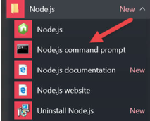

# การติดตั้ง Node.js, npm และ VisualStudio Code

ก่อนเขียน Ionic เราต้องติดตั้ง ซอฟต์แวร์ และเครื่องมือกันก่อน ประกอบด้วย Node.js, npm และ Visual Studio Code
# การติดตั้ง Node.js และ npm
การติดตั้ง Node.js สามารถดาวน์โหลดการติดตั้ง ได้โดยตรงที่เว็บ https://nodejs.org/en/download เราสามารถติดตั้ง ได้ทั้ง Windows, Linux และ Mac ในที่นี้จะใช้ Node.js สําหรับ Windows เป็นหลัก แต่ถ้าใครใช้ Mac หรือ Linux ก็ใช้ได้ไม่มีปัญหา เพราะคําสั่งต่างๆนั้นเหมือนกัน

ในการเขียน Ionic Framework 3 แนะนําให้ใช้ Node.js เวอร์ชัน LTS (สําหรับเครื่อง mac หากมีปัญหาในการใช้งานสามารถถอยลง มา1เวอร์ชั่นก็ได้เช่นเดียวกัน)

> หลังจากดาวน์โหลดมาแล้วให้ดำเนินการติดตั้งให้เสร็จเสร็จเรียบร้อย

## การตรวจสอบเวอร์ชัน Node.js และ npm
หลังจากติดตั้ง Node.js เรียบร้อยให้ตรวจสอบเวอร์ชนัของ Node.js และnpmด้วยเพื่อตรวจสอบว่าเราได้ติดตั้ง Node.js สมบรูณ์พร้อม ใช้งานหรือไม่ ให้เปิด Node.js command prompt (จะค้นหา หรือคลิกที่ Start Menu ของ Windows ก็ได้)

เมื่อเปิดขึ้นมาแล้วให้พมิพ์คาํสั่ง `node-v` แล้วกดenterเพื่อตรวจสอบเวอร์ชนัของ Node.js และพิมพ์ `npm-v` แล้วกด Enterเพื่อตรวจสอบเวอร์ชั่นอง npm ดังรูป

> Note: การเปิดใช้งานNode.jscommandpromptทกุครั้งแนะนำให้คลกิขวาแล้วเลอืก __Runasadministrator__ ทกุครั้ง

# รู้จักกับ npm
npm เป็นตัวจัดการ dependencies หรือไลบรารีต่างๆ ในโปรเจคของเรา ข้อดีคือ เราไม่ต้องเข้าเว็บเพื่อไปดาวน์โหลดไฟล์มาติดตั้ง ทีละตัวเราสามารถใช้ npm จัดการการติดตั้ง หรือลบ dependencies ต่างๆ ได้อย่างสะดวก (ผ่านอินเทอร์เน็ต)

# สรุปคำสั่ง npm พื้นฐาน

| คำสั่ง | คำอธิบาย |
| --------- | ---------- |
|   npm init   |    เริ่มต้นใช้งาน และช่วยให้เราสร้าง และใส่รายละเอียดเกี่ยวกับโปรเจคของเรา (package.json)   |
|   npm install module_name   |    ติดตั้ง module   |
|   npm install -g module_name   |    ติดตั้ง module ในระดับ global   |
|   npm install module_name --save   |    ติดตั้ง module และเพิ่มมัน เข้าไปในไฟล์ package.json (ข้างใน dependencies)   |
|   npm install module_name --save-dev   |    เหมือนกันกับข้างบน ติดตั้ง module และเพิ่มมัน เข้าไปในไฟล์ package.json (ข้างใน dependencies)และบอกวา่จะนํามาช่วยในสว่นของการพฒันา   |
|   npmlist   |    แสดงรายการmodulesทั้งหมดที่ติดตั้งไปแล้วในโปรเจคของเรา   |
|   npmlist-g    |    แสดงรายการmodulesระดับglobalทั้งหมดที่ถกูติดตั้งบนOSของเรา   |
|   npm uninstall module_name   |    uninstall module ออกจากโปรเจคของเรา   |
|   npm uninstall -g module_name   |    uninstall module ระดับ global   |
|   npm uninstall module_name --save   |    uninstall module ออกจากโปรเจคของเรา พร้อมทั้งนําออกจาก attribute dependencies ในไฟล์ package.json   |
|   npmuninstallmodule_name--save-dev   |    เหมือนกนักบัด้านบนuninstallmoduleออกจากโปรเจคของเราพร้อมทั้งนําออกจาก attribute dependencies ในไฟล์ package.json   |
|   npm update module_name   |    update เวอร์ชั่น module ให้ใหมล่า สดุ   |
|   npm update -g module_name   |    update เวอร์ชนั module ให้ใหมล่าสดุ ในระดับ global   |
|   npm -v   |    แสดงเวอร์ชนัปัจจบันของ npm   |

 
 

---

 จัดทำโปรแกรมคอมพิวเตอร์พัฒนาระบบงานธุรกิจส่วนตัวและหน่วยงาน ใส่ใจคุณภาพ คุ้มราคา ส่งงานตรงเวลา ติดต่อ 086-288-7987 (ท็อป) หรืออีเมล์    nakomah.web@gmail.com ติดตามผลงานได้ที่ <a href="https://nakomah.com" target="_blank">www.nakomah.com</a>
