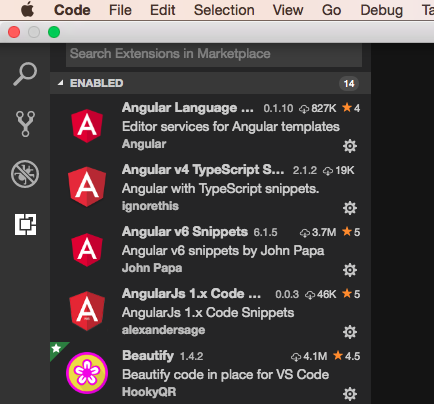

# การติดตั้ง VS Code และ Extensions
> การพัฒนาแอพ iOS และ Android แบบ Cross Platform นั้นในที่นี้จะใช้โปรแกรม Visual Studio Code
สามารถดาวน์โหลดได้ที่ https://code.visualstudio.com/download และดำเนินการติดตั้งโปรแกรมให้เรียบร้อย

# วิธีค้นหา และติดตั้ง Extension ของ Visual Studio Code
หลังจากเปิดโปรแกรม Visual Studio Code แล้ว เราสามารถเลือกส่วน Extension ได้จากแถบเครื่องมือด้านซ้าย
 - เลือก Extension จากเมนูด้านซ้าย
 - ใช้กล่องค้นหา เพื่อค้นหา Extension ที่ต้องการ
 - สามารถดูรายชื่อ, อัพเดต, หรือถอนการติดตั้ง Extension ได้ 

# Extension สำหรับใช้ในการเรียนพัฒนาแอพ iOS และ Android 
- [Auto Close Tag](https://marketplace.visualstudio.com/items?itemName=formulahendry.auto-close-tag) (Jun Han)
- [Auto Rename Tag](https://marketplace.visualstudio.com/items?itemName=formulahendry.auto-rename-tag) (Jun Han)
- [Beautify](https://marketplace.visualstudio.com/items?itemName=HookyQR.beautify) (HookyQR)
- [IntelliSense for CSS class names in HTML](https://marketplace.visualstudio.com/items?itemName=Zignd.html-css-class-completion) (Zignd)
- [jQuery Code Snippets](https://marketplace.visualstudio.com/items?itemName=donjayamanne.jquerysnippets) (Don Jayamanne)
- [Path Autocomplete](https://marketplace.visualstudio.com/items?itemName=ionutvmi.path-autocomplete) (Mihai Vilcu)
- [Prettier - Code formatter](https://marketplace.visualstudio.com/items?itemName=esbenp.prettier-vscode) (Esben Petersen)
- [vscode-icons](https://marketplace.visualstudio.com/items?itemName=robertohuertasm.vscode-icons) (Roberto Huertas)
- [Angular Essentials](https://marketplace.visualstudio.com/items?itemName=johnpapa.angular-essentials) (John Papa)
- [Angular 6 Snippets - TypeScript, Html, Angular Material, ngRx, RxJS & Flex Layout](https://marketplace.visualstudio.com/items?itemName=Mikael.Angular-BeastCode) (Mikael Morlund)

 
 

---

 จัดทำโปรแกรมคอมพิวเตอร์พัฒนาระบบงานธุรกิจส่วนตัวและหน่วยงาน ใส่ใจคุณภาพ คุ้มราคา ส่งงานตรงเวลา ติดต่อ 086-288-7987 (ท็อป) หรืออีเมล์    nakomah.web@gmail.com ติดตามผลงานได้ที่ <a href="https://nakomah.com" target="_blank">www.nakomah.com</a>
